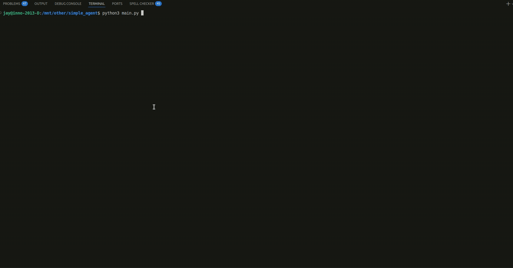
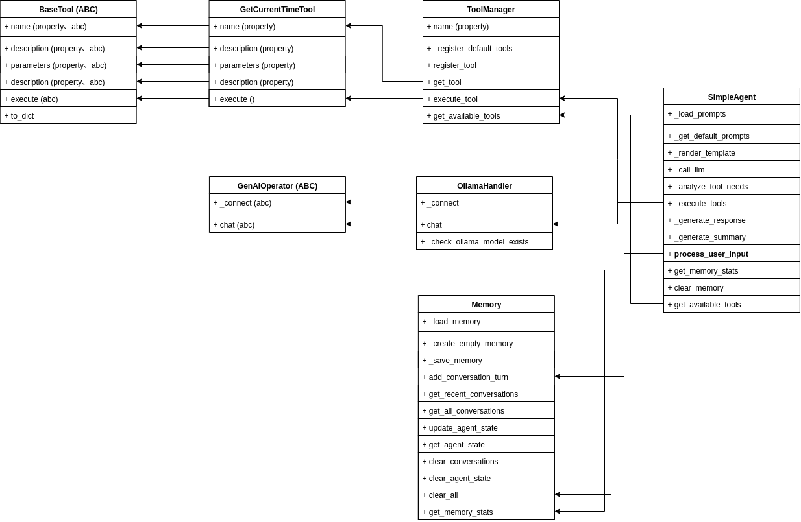

# Simple Agent

A lightweight, extensible ReAct (Reasoning and Acting) agent module powered by Large Language Models (LLM). This agent can analyze user requests, decide which tools to use, execute them, and provide intelligent responses.



## Architecture ( UML )



## 🚀 Features

- **ReAct Architecture**: Implements the Reasoning and Acting paradigm for intelligent decision-making
- **Tool Integration**: Extensible tool system with built-in support for various utilities
- **Memory Management**: Persistent conversation history with JSON-based storage
- **Jinja2 Templates**: Flexible prompt management using Jinja2 templating engine
- **LLM Integration**: Compatible with Ollama and other OpenAI-compatible APIs
- **Interactive CLI**: User-friendly command-line interface

## 📁 Project Structure

```
simple_agent/
├── main.py                    # Main entry point
├── requirements.txt           # Python dependencies
├── memory.json               # Conversation history (auto-generated)
└── src/
    ├── agent/
    │   ├── core.py           # Main agent logic
    │   └── utils/
    │       ├── memory.py     # Memory management
    │       └── prompt.json   # Jinja2 prompt templates
    ├── GenAIServices/
    │   ├── __init__.py
    │   ├── core.py           # Base GenAI interface
    │   └── ollama.py         # Ollama API integration
    └── tools/
        └── core.py           # Tool management and implementations
```

## 🛠️ Installation

1. **Clone the repository** (if applicable):
   ```bash
   git clone <repository-url>
   cd simple_agent
   ```

2. **Install dependencies**:
   ```bash
   pip install -r requirements.txt
   ```

3. **Ensure your LLM service is running**:
   - The default configuration uses Ollama at `http://10.204.16.64:6589/model_server/`
   - Make sure your LLM service is accessible at the configured URL

## 🚀 Quick Start

### Interactive Mode
```bash
python main.py
```

### Single Query Mode
```bash
python main.py -q "What time is it?"
```

### Custom Configuration
```bash
python main.py --ollama-url http://localhost:11434/ --model llama3.2:1b
```

## 💬 Usage Examples

### Interactive Commands
- `help` - Show available commands
- `stats` - Display agent statistics and memory info
- `tools` - List available tools
- `clear` - Clear conversation memory
- `quit`/`exit`/`bye` - Exit the application

### Sample Conversations
```
You: What time is it?
Agent: The current time is 2025-08-11 14:30:25
```

## 🔧 Configuration

### Command Line Arguments
- `--ollama-url`: LLM service URL (default: `http://10.204.16.64:6589/model_server/`)
- `--model`: Model name to use (default: `gpt-oss:20b`)
- `--memory-file`: Path to memory file (default: `memory.json`)
- `-q, --query`: Process single query and exit

### Environment Variables
You can also configure the agent through environment variables:
```bash
export OLLAMA_URL="http://localhost:11434/"
export MODEL_NAME="llama3.2:1b"
```

## 🔌 Extending the Agent

### Adding New Tools

1. **Create a new tool class** in `src/tools/core.py`:
   ```python
   class MyCustomTool(BaseTool):
       @property
       def name(self) -> str:
           return "my_custom_tool"
       
       @property
       def description(self) -> str:
           return "Description of what this tool does"
       
       @property
       def parameters(self) -> Dict[str, Any]:
           return {
               "type": "object",
               "properties": {
                   "param1": {"type": "string", "description": "Parameter description"}
               }
           }
       
       def execute(self, **kwargs) -> str:
           # Your tool implementation here
           return "Tool result"
   ```

2. **Register the tool** in `ToolManager._register_default_tools()`:
   ```python
   def _register_default_tools(self):
       self.register_tool(GetCurrentTimeTool())
       self.register_tool(MyCustomTool())  # Add your tool here
   ```

### Customizing Prompts

Edit `src/agent/utils/prompt.json` to modify how the agent behaves:
- `system_prompt`: Agent's personality and behavior
- `tool_selection_prompt`: How the agent decides which tools to use
- `response_generation_prompt`: How the agent formats responses
- `summary_prompt`: How conversation summaries are generated

### Adding New LLM Providers

1. Create a new handler in `src/GenAIServices/`
2. Inherit from `GenAIOperator` base class
3. Implement the required methods
4. Update the agent initialization in `main.py`

## 🔍 Architecture

### ReAct Loop
1. **Reasoning**: Agent analyzes user input and decides if tools are needed
2. **Acting**: If tools are required, agent executes them with extracted parameters
3. **Response**: Agent generates a response incorporating tool results and context

### Components
- **Agent Core**: Main reasoning and coordination logic
- **Tool Manager**: Handles tool registration and execution
- **Memory Manager**: Persists conversation history
- **GenAI Services**: Abstracts LLM communication
- **Prompt Templates**: Jinja2-based prompt management

## 🐛 Troubleshooting

### Common Issues

1. **Connection Error**:
   ```
   Error calling LLM: Connection failed
   ```
   - Check if your LLM service is running
   - Verify the URL in `--ollama-url` parameter

2. **Model Not Found**:
   ```
   Error: Model 'gpt-oss:20b' not found
   ```
   - Ensure the model is available in your LLM service
   - Use `--model` parameter to specify a different model

3. **JSON Parsing Error**:
   ```
   Could not parse tool analysis response
   ```
   - This usually indicates the LLM is having trouble following instructions
   - Try a different model or adjust the prompts

### Debug Mode
Add debug prints to see what's happening:
```python
# In src/agent/core.py, add debugging
print(f"Tool analysis result: {tool_analysis}")
print(f"LLM response: {response}")
```

## 📝 Development

### Running Tests
```bash
# Test basic functionality
python main.py -q "hello"

# Test tool functionality  
python main.py -q "what time is it"
```
## 🤝 Contributing

1. Fork the repository
2. Create a feature branch
3. Make your changes
4. Add tests if applicable
5. Submit a pull request

## 📄 License

This project is open source. Please check the license file for details.
